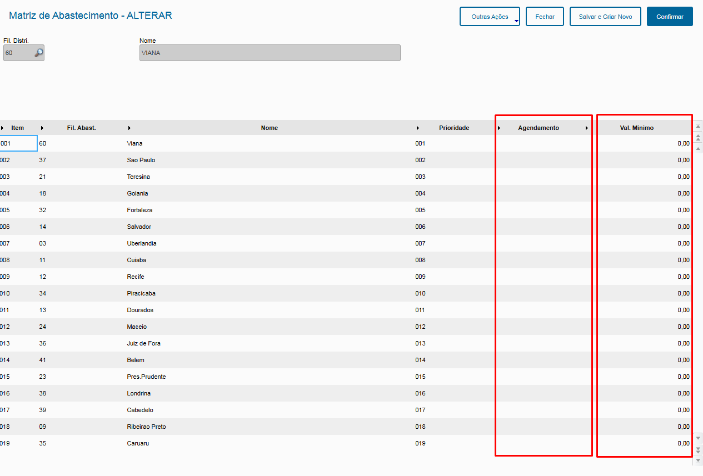
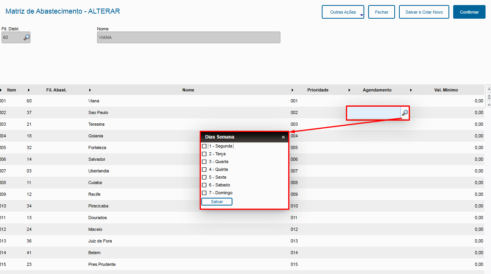
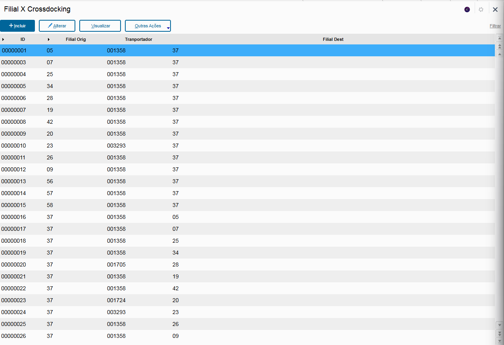
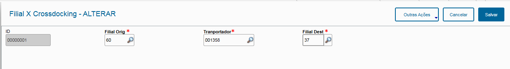
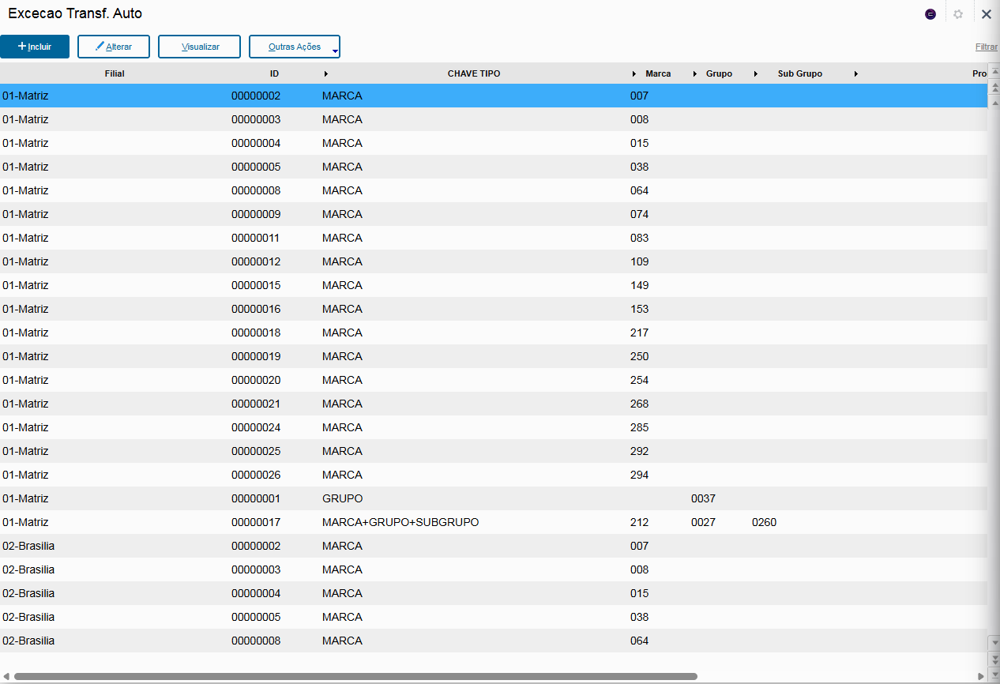
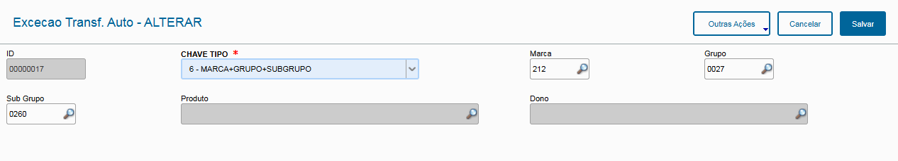

# Abastecimento Automático - Central de Compras

Esta rotina foi desenvolvida para automatizar o abastecimento de mercadorias nas filiais, diretamente a partir do Centro de Distribuição (CD).

O processo se baseia em uma análise estatística das vendas de cada produto para determinar as quantidades ideais a serem enviadas, garantindo um suprimento eficiente e alinhado à demanda real.

Como Funciona:

Totalmente automatizado: O sistema opera sem a necessidade de intervenção manual, a partir de configurações prévias. Não há uma interface de acesso para interação direta.

Regras de abastecimento: O processo segue a regra de cobertura ABC, identificando a necessidade de cada filial. O sistema avalia a disponibilidade do produto no CD e, se houver estoque suficiente, realiza o abastecimento de forma automática para as filiais que precisam.

----

## Matriz de abastecimento

Este é o cadastro responsável por montar a estrutura de CD e filiais dependentes, ele é a base fundamental para o funcionamento correto de todas as rotinas do central de compras.

### Configuração para o abastecimento automático

Neste cadastro ao clicar em alterar qualquer filial na estrutura do CD, será aberta a seguinte tela:

Ao clicar duas vezes na célula **Agendamento**, o campo deverá ser editado, ao clicar na lupa, o sistema apresenta uma janela, com dias da semana.

Preencham os dias da semana que a filial em questão receberá os pedidos de transferência. Exemplo: 2-Terça, 4-Quinta, significa que a filial distribuidora irá emitir pedidos de transferência todas as semanas nos dias selecionados para a filial referente.

Preencham também a coluna **Val. Mínimo**, essa coluna é responsável por garantir que o sistema não irá realizar pedidos de abastecimento automático caso o lote de abastecimento fique com o valor menor do que o definido neste campo.

**O não preenchimento dos campos de agendamento impede que o sistema realize os devidos abastecimentos automáticos. Caso queiram apenas testar a nova funcionalidade de abastecimento, preencha o campo agendamentos somente nas filiais que desejam emitir os pedidos de transferência.**

----

## De para Crossdocking

Este é um cadastro extremamente necessário para o bom e correto funcionamento do abastecimento automático sem correções humanas no meio do processo.
Nesta rotina será necessário realizar o cadastro da Filial Origem (CD), a transportadora a ser utilizada e a filial destino (Abastecida).

### Parametrização

O cadastro é bastante simples, como o sistema irá trabalhar apenas como abastecimento do CD para as filiais, estou exemplificando um cadastro, onde a mercadoria sai do CD, filial 60, utiliza a transportadora 001358 para abastecer a filial 37.

Ao acessar a rotina, irão se deparar com diversos cadastros já realizados, esses cadastros foram feitos na época do antigo gestor de Supply Chain Wagner das Neves Iwashita. **Se necessário, exclua os cadastros antigos**.

----

## Exceção Transf. Auto

Cadastro simples apenas para realizar a parametrização das marcas, grupos, subgrupos e produtos que serão excluídos do abastecimento automático.

### Parametrização

Nesta rotina vocês deverão cadastrar cuidadosamente as regras de exceção de abastecimento automático, Ex: Óleos e Lubrificantes.

A exceção é cadastrada por filial e possui as seguintes opções para cadastrar:
1. MARCA
2. GRUPO
3. SUBGRUPO
4. PRODUTO
5. MARCA+GRUPO
6. MARCA+GRUPO+SUBGRUPO
7. MARCA+GRUPO+SUBGRUPO+PRODUTO
8. DONO

Exemplo:

Esse é um cadastro legado do antigo gestor de Supply Chain Wagner das Neves Iwashita. **Se necessário, exclua os cadastros antigos**.

Marca/classe 212 + Grupo 0027 + Subgrupo 0260
Marca = Varga
Grupo = Freio
SubGrupo = Fluido de Freio

Esse tipo de cadastro impede que o sistema realize o abastecimento de produtos que atendam essas regras.
