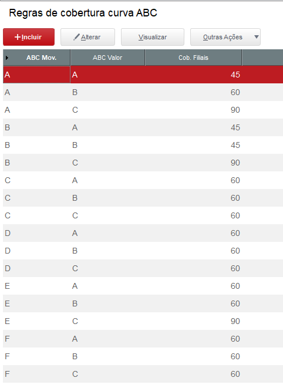
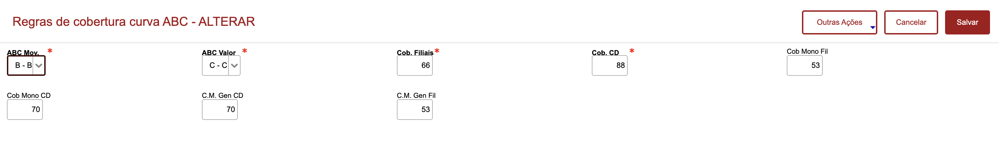

# ABC Regras de Cobertura (AG)

**Regras de cobertura para curvas ABC**

## Dados da Customização

Analista: Jonathan Torioni

Fonte: CCXFUN.PRW

----

## Especificação da customização

Axcadastro simples apenas para realizar o cadastro de regras de cobertura de estoque por curvas abc.

----

## Cadastro:

Menu: Cobertura ABC

1 - Browser de cadastro de coberturas

2 - Inclusão de regras

Cadastrar regra conforme:   
**ABC Movimentação**    
**ABC Valor**  
**Cobertura Filiais** - Quantidade de dias de cobertura para filais   
**Cobertura CD** - Quantidade de dias de cobertura para o CD    
**Cobertura Monofasicos filiais** - Quantidade de dias de cobertura para itens monofasicos nas filiais      
**Cobertura Monofasicos CD** - Quantidade de dias de cobertura para itens monofasicos no CD     
**Cob. Mono. Genuino CD** - Quantidade de dias de cobertura para itens monifasicos genuinos no CD       
**Cob. Mono. Genuino Filial** - Quantidade de dias de cobertura para itens monofasicos genuinos nas filiais 

## Tabela 
### Campos

X3_ARQUIVO|X3_CAMPO|X3_TIPO|X3_TAMANHO|X3_DECIMAL|X3_TITULO
---|---|---|---|---|---
PD7|PD7_FILIAL|C| 2|0|Filial      
PD7|PD7_ABCMOV|C| 1|0|ABC Mov.     
PD7|PD7_ABCVAL|C| 1|0|ABC Valor   
PD7|PD7_COBFIL|N| 3|0|Cob. Filiais
PD7|PD7_COBCD |N| 3|0|Cob. CD       
PD7|PD7_MONFIL |N| 3|0|Cob. CD       
PD7|PD7_MONOCD |N| 3|0|Cob. CD       
PD7|PD7_MGECD |N| 3|0|C.M. Gen CD         
PD7|PD7_MGEFIL |N| 3|0|C.M. Gen Fil   

### Indices

INDICE|ORDEM|CHAVE
---|---|---
PD7|01|PD7_FILIAL+PD7_ABCMOV+PD7_ABCVAL
