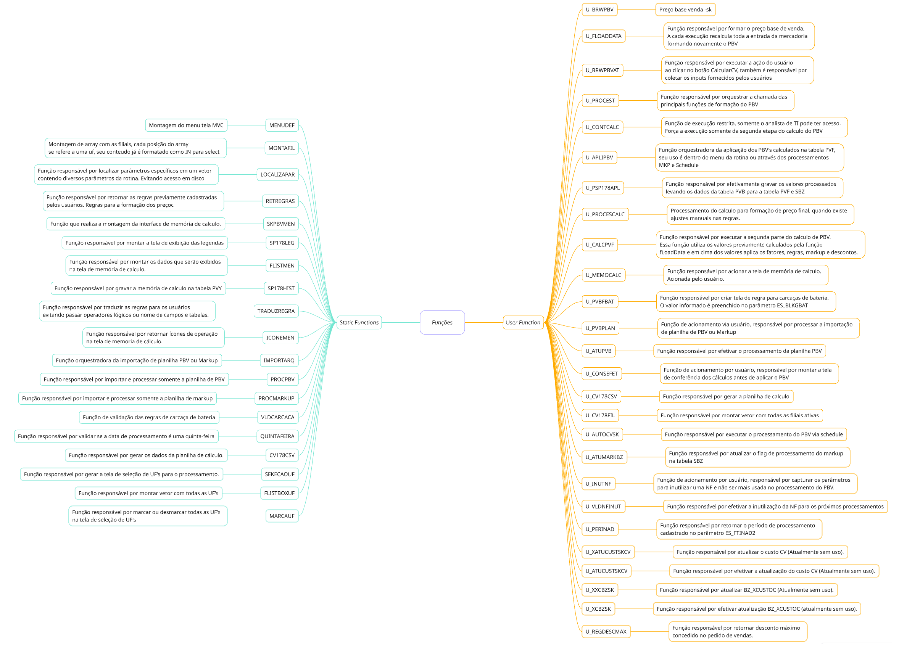

# BRWPBV.PRW

Idealizador: Fernando Carvalho

Colaboradores: Lucas Graglia, Jonathan Torioni

Data de criação: 27/06/2023

----

## Objetivo

----

## Tabelas

Tabelas envolvidas no processo de formaçãõ de preços, descrições retiradas do dicionário SX2.

* **ZDH** - Cadastro de promoções
* **PVF** - Preço de venda final aplicado
* **PVB** - Preço de venda base
* **PBV** - Calculo PBV SK
* **PCY** - Preço para ecommerce
* **PBQ** - Regras PBV (Royalties)
* **ZCT** - Cadastro de markup
* **PVY** - Memoria de calculo PVB

----

## Parâmetros  

**Abaixo estão listados os parâmetros mais importantes para a formação do preço base de venda**

- **ES_XCVDTV** - Parâmetro responsável por armazenar a data de corte referente ao regime especial das UF's PA e MG (**Esse parâmetro deve ser criado de forma compartilhada na SX6 obrigatoriamente**)
- **ES_XRSDTV** - Parâmetro responsável por armazenar a data de corte referente ao regime especial da UF RS (**Esse parâmetro deve ser criado de forma compartilhada na SX6 obrigatoriamente**)

----

## Funções

1. **U_BRWPBV** - Preço base venda -sk

2. **MENUDEF** - Montagem do menu tela MVC

3. **MONTAFIL** - Montagem de array com as filiais, cada posição do array
se refere a uma uf, seu conteudo já é formatado como IN para select

4. **U_FLOADDATA** - Função responsável por formar o preço base de venda.
A cada execução recalcula toda a entrada da mercadoria
formando novamente o PBV

5. **U_BRWPBVAT** - Função responsável por executar a ação do usuário
ao clicar no botão CalcularCV, também é responsável por
coletar os inputs fornecidos pelos usuários

6. **U_PROCEST** - Função responsável por orquestrar a chamada das
principais funções de formação do PBV

7. **U_CONTCALC** - Função de execução restrita, somente o analista de TI pode ter acesso.
Força a execução somente da segunda etapa do calculo do PBV

8. **U_APLIPBV** - Função orquestradora da aplicação dos PBV's calculados na tabela PVF, 
seu uso é dentro do menu da rotina ou através dos processamentos
MKP e Schedule

9. **U_PSP178APL** - Função responsável por efetivamente gravar os valores processados
levando os dados da tabela PVB para a tabela PVF e SBZ

10. **LOCALIZAPAR** - Função responsável por localizar parâmetros específicos em um vetor
contendo diversos parâmetros da rotina. Evitando acesso em disco

11. **U_PROCESCALC** - Processamento do calculo para formação de preço final, quando existe
ajustes manuais nas regras.

12. **RETREGRAS** - Função responsável por retornar as regras previamente cadastradas
pelos usuários. Regras para a formação dos preço

13. **U_CALCPVF** - Função responsável por executar a segunda parte do calculo de PBV.
Essa função utiliza os valores previamente calculados pela função
fLoadData e em cima dos valores aplica os fatores, regras, markup e descontos.

14. **U_MEMOCALC** - Função responsável por acionar a tela de memória de calculo.
Acionada pelo usuário.

15. **SKPBVMEM** - Função que realiza a montagem da interface de memória de calculo.

16. **SP178LEG** - Função responsável por montar a tela de exibição das legendas

17. **FLISTMEM** - Função responsável por montar os dados que serão exibidos
na tela de memória de calculo.

18. **SP178HIST** - Função responsável por gravar a memória de calculo na tabela PVY

19. **TRADUZREGRA** - Função responsável por traduzir as regras para os usuários
evitando passar operadores lógicos ou nome de campos e tabelas.

20. **ICONEMEM** - Função responsável por retornar ícones de operação
na tela de memoria de cálculo.

21. **U_PVBFBAT** - Função responsável por criar tela de regra para carcaças de bateria.
O valor informado é preenchido no parâmetro ES_BLKGBAT

22. **U_PVBPLAN** - Função de acionamento via usuário, responsável por processar a importação
de planilha de PBV ou Markup

23. **IMPORTARQ** - Função orquestradora da importação de planilha PBV ou Markup

24. **PROCPBV** - Função responsável por importar e processar somente a planilha de PBV

25. **U_ATUPVB** - Função responsável por efetivar o processamento da planilha PBV

26. **PROCMARKUP** - Função responsável por importar e processar somente a planilha de markup

27. **VLDCARCACA** - Função de validação das regras de carcaça de bateria

28. **U_CONSEFET** - Função de acionamento por usuário, responsável por montar a tela
de conferência dos cálculos antes de aplicar o PBV

29. **QUINTAFEIRA** - Função responsável por validar se a data de processamento é uma quinta-feira

30. **U_CV178CSV** - Função responsável por gerar a planilha de calculo

31. **CV178CSV** - Função responsável por gerar os dados da planilha de cálculo.

32. **SELECAOUF** - Função responsável por gerar a tela de seleção de UF's para o processamento.

33. **FLISTBOXUF** - Função responsável por montar vetor com todas as UF's

34. **U_CV178FIL** - Função responsável por montar vetor com todas as filiais ativas

35. **MARCAUF** - Função responsável por marcar ou desmarcar todas as UF's
na tela de seleção de UF's

36. **U_AUTOMCVSK** - Função responsável por executar o processamento do PBV via schedule

37. **U_ATUMARKBZ** - Função responsável por atualizar o flag de processamento do markup
na tabela SBZ

38. **U_INUTNF** - Função de acionamento por usuário, responsável por capturar os parâmetros
para inutilizar uma NF e não ser mais usada no processamento do PBV.

39. **U_VLDNFINUT** - Função responsável por efetivar a inutilização da NF para os próximos processamentos

40. **U_PERINAD** - Função responsável por retornar o período de processamento
cadastrado no parâmetro ES_FTINAD2

41. **U_XATUCUSTSKCV** - Função responsável por atualizar o custo CV (Atualmente sem uso).

42. **U_ATUCUSTSKCV** - Função responsável por efetivar a atualização do custo CV (Atualmente sem uso).

43. **U_XXCBZSK** - Função responsável por atualizar BZ_XCUSTOC (Atualmente sem uso).

44. **U_XCBZSK** - Função responsável por efetivar atualização BZ_XCUSTOC (atualmente sem uso).

45. **U_REGDESCMAX** - Função responsável por retornar desconto máximo
concedido no pedido de vendas.

----

## Novos campos

**Campos adicionados pelo analista Jonathan - Melhorias**

* **PVB->PVB_CREAL** - Custo real -> D1_CUSTO/D1_QUANT
* **PVF->PVF_CREAL** - Custo real -> D1_CUSTO/D1_QUANT

Ambos os campos são do tipo númerico, tamanho 16, decimal 2.

----

## Exceções

Durante a formação do preço base de vendas, existem algumas exceções que impedem propositalmente que o preço base seja recalculado. Sendo:

1. Quando as filiais das unidades federativas for PA ou MG e a data de emissao da nota for menor que  01/06/2024 (**ES_XCVDTV**)

2. Quando as filiais da unidade federativa for RS e a data de emissao da nota for menor que 01/11/2024 (**ES_XRSDTV**)

3. Quando for nota de transferência e não for o fornecedor: 000009/63 (Viana)

Devido a mudança de regime especial nas UF's **PA, MG e RS**, foi introduzida uma data de corte, o preço base de vendas passa a ser formado por novas regras tributárias.

Com relação a regra 3, foi definido em concelho. Viana tem uma vantagem competitiva em relação ao custo de mercadoria, fazendo com que os preços só sejam atualizado em caso de transferências quado o fornecedor for o CD de VIANA (ES).

----

## Mapa Mental

----

## Versões

### v1.00

Ultima versão entregue pelo analista Lucas Graglia

### v1.01

Ajustes realizados para que Paraná recebe as transferências de Viana aplicando o fator de transferência da mesma maneira que São Paulo. **Comentário na variável cClassFis "60", lin: 1198**. (E-mail ref: Viana x Parana)

### v2.00

Esta versão implementa diversas melhorias visando a garantia do processo de formação de preços, melhorias:

- Melhoria na aplicação do CV Calculado, impedindo a aplicação do CV caso, o interno revendedor em relação ao custo ultrapasse 300% e caso o interno revendedor esteja menor que o CV calculado;

- Melhoria de performance e integridade na aplicação de MKP de produtos Royalties;

- Melhoria no calculo do produtos Royalties evitando multiplicação do preço quando reprocessado multiplas vezes;

- Melhoria de performance de todas as querys contidas no fonte;

- Reestruturação dos processos evitando chamada desnecessária de startjob, evitando consumo elevado dos recursos da maquina que está executando o processamento;

- Tratativa para processar somente em UF's selecionadas, evitando que tenha o acesso a selecionar todas as UF's de uma unica vez, evitando o processamento em Unidades indesejadas;

- Adicionado 2 novos campos um na tabela PVB e outro na tabela PVF, para gravar o custo real do produto sem manipulação por parte dos compradores, facilitando a identificação de eventuais erros de calculos em conferências manuais;

- Ajuste e correção de erros na funcionalidade de gerar planilha;

- Correção de erro contido Alias In Use U_CV178FIL;

- Melhoria/Ajuste não permitir o processamento em todas as UF's ao rodar o MKP;

- Remoção de código inutilizado;

- Documentação dentro do código em todas as funções do fonte;

----
