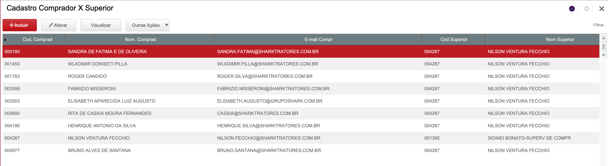
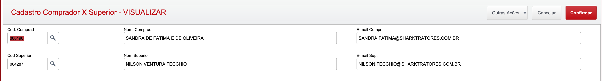

# Comprador x Superior

**Cadastro de comprador x superior**

## Dados da Customização

Analista: Jonathan Torioni

Fonte: CCXFUN.PRW

----

## Especificação da customização

Axcadastro simples apenas para realizar o cadastro de regras de comprador x superior

Esta customização foi desenvolvida para suprir a necessidade de ter o comprador da empresa e o seu respectivo superior.
Essa informação é utilizada na alteração da sugestão de compras. Quando o comprador realizar um ajuste na sugestão, o superior do mesmo é notificado de todas as modificações realizadas.

Essas informações também são utilizadas para notificar todos os compradores após a emissão automática das sugestões de compras.

----

## Cadastro:

### Browser:

----

### Campos:

* Cod. Comprad. - Códido de usuário do comprador
* Nom. Comprad. - Nome do comprador (Preenchimento automatico)
* E-mail Compr. - E-mail do comprador (Preenchimento automatico mediante ao cadastro de compradores)
* Cod. Superior - Código de usuário do superior
* Nom Superior - Nome do Superior (Preenchimento automatico)
* E-mail Sup. - E-mail do superior (Preenchimento automatico mediante ao cadastro de compradores)

----
