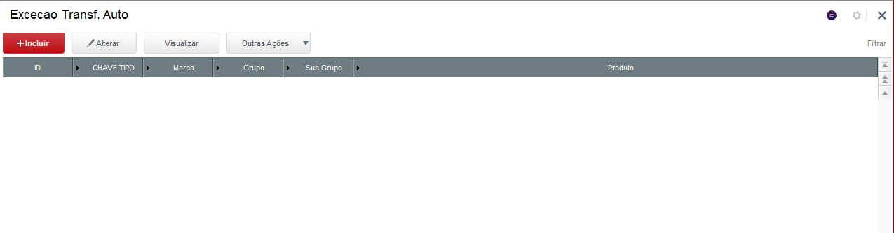
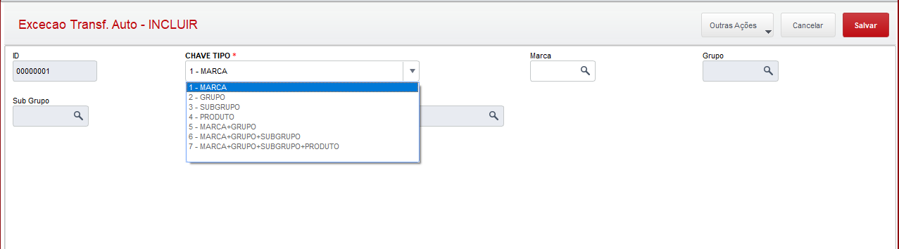
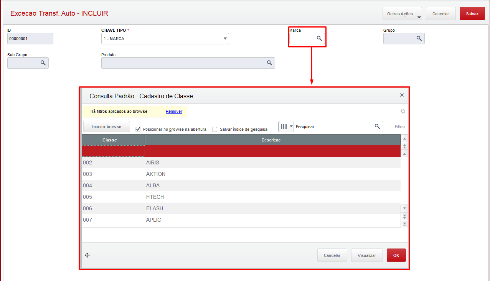
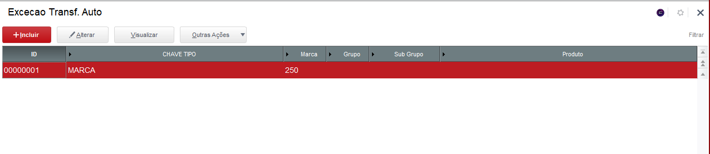
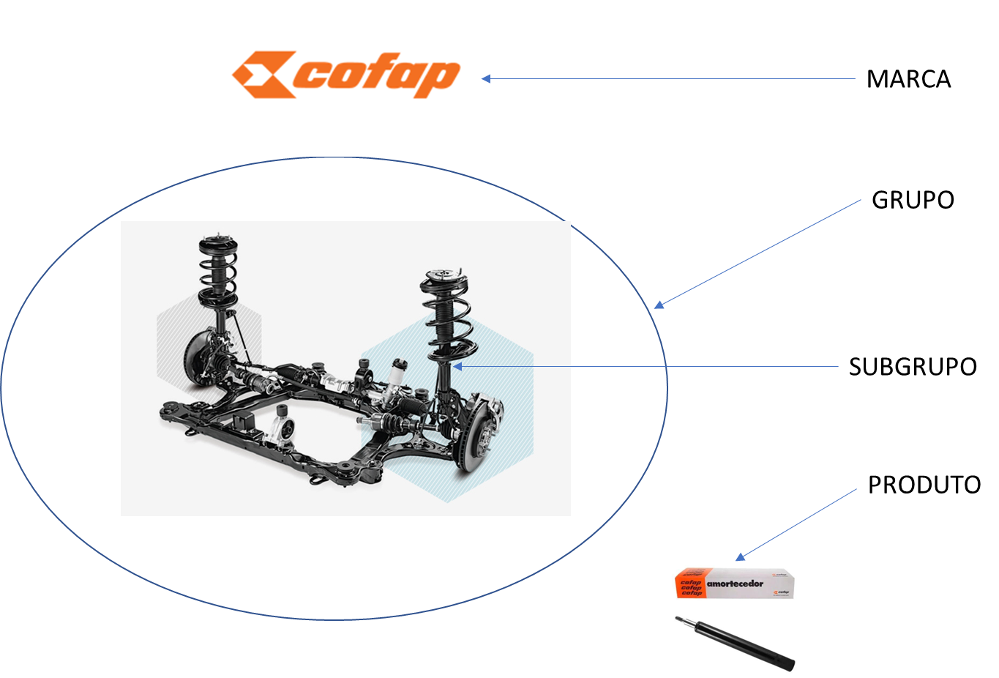

# Exclusão de abastecimentos automáticos

**Exclusão de produtos por marcas, grupos e subgrupos do abastecimento automático**

----

### Dados da Customização

----

Analista: Jonathan Torioni  
Fonte: **shexcecaoprod.prw**

----

### Especificação da Customização

Axcadastro simples apenas para realziar o cadastro das marcas, grupos, subgrupos e produtos que serão excluidos do abastecimento automático dos produtos.

----

### Cadastro

Menu: **Excecao Transf. Auto**

1- Tela inicial do cadastro de excecao

2- Ao clicar em incluir, a tela abaixo será apresentada, basta selecionar dentro do campo **CHAVE TIPO** o tipo de exceção que irá cadastrar.

3- Todos os campos possuem consulta padrão, isso siginifica que ao clicar na lupa contida dentro do campo, será apresentada uma tela referente ao conteudo do campo. Isso facilita a visualização e busca do conteúdo.

4- Ao termino do cadastro, clique em salvar na tela anterior e o cadastro estará finalizado e pode ser visualizado no browser inicial da rotina.

:::info
Os campos somente serão liberados para edição mediante a seleção do campo **CHAVE TIPO**
:::
----

### Tabela - Campos

Tabela: **PD5**

X3_ARQUIVO|X3_CAMPO    |X3_TIPO|X3_TAMANHO|X3_DECIMAL|X3_TITULO|X3_WHEN
----------|------------|-------|----------|----------|---------|-------------
PD5       |PD5_FILIAL  |C      |02        |0         |Filial   |
PD5       |PD5_ID      |C      |08        |0         |ID       |
PD5       |PD5_CHAVE   |C      |01        |0         |Chave Tp |
PD5       |PD5_MARCA   |C      |03        |0         |Marca    |M->PD5_CHAVE$"1/5/6/7"
PD5       |PD5_GRUPO   |C      |04        |0         |Grupo    |M->PD5_CHAVE$"2/5/6/7"
PD5       |PD5_SUBGRUPO|C      |04        |0         |SubGrupo |M->PD5_CHAVE$"3/6/7"
PD5       |PD5_PRODUTO |C      |27        |0         |Produto  |M->PD5_CHAVE$"4/7"

----

### Tabela - Indices

Tabela: **PD5**

INDICE|ORDEM|CHAVE
------|-----|-----
PD5   |01   |PD5_FILIAL+PD5_CHAVE
PD5   |02   |PD5_FILIAL+PD5_MARCA
PD5   |03   |PD5_FILIAL+PD5_GRUPO
PD5   |04   |PD5_FILIAL+PD5_SUBGR
PD5   |05   |PD5_FILIAL+PD5_PROD
PD5   |06   |PD5_FILIAL+PD5_MARCA+PD5_GRUPO+PD5_SUBGR+PD5_PROD

----

### Hierarquia de Produto - SK

**Ilustração da estrutura de hierarquia de produtos na SK**

