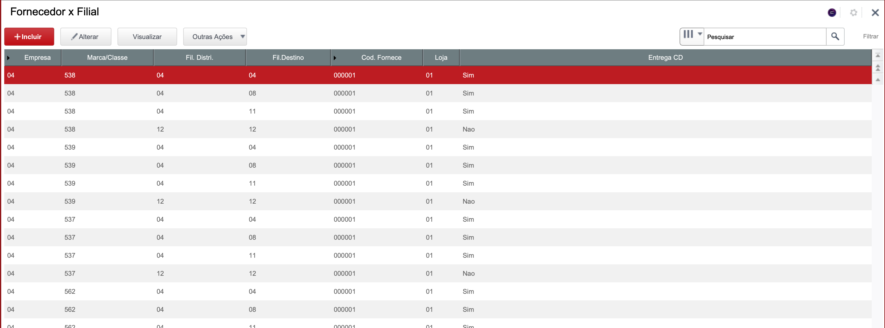
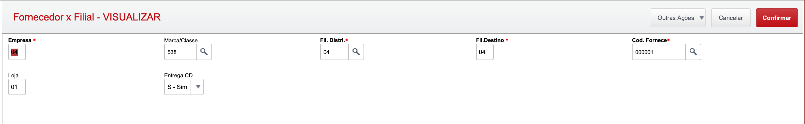

# Fornecedor x Filial Entrega

## Dados da Customização

Analista: Luiz Eduardo

Fonte: SHPCECOM.PRW

----

## Especificação da customização

Axcadastro simples apenas para realizar o cadastro de regras de fornecedor x filial de entrega

Esta customização foi desenvolvida com base na necessidade de saber qual fornecedor/loja entregará na filial ou no CD, isso se deve a customização de geração automatica de sugestões de compras

----

## Cadastro:

### Browser:

----

### Campos:

* **Empresa** - Código da empresa.
* Marca/Classe - Marca/Classe do fornecedor.
* **Fil. Dristri.** - Filial distribuidora, presente do cadastro de matriz de abastecimento.
* **Fil. Destino** - Filial destino da mercadoria.
* **Cod. Fornece** - Código do fornecedor para o correto preenchimento da sugestão de compras.
* Loja - Loja do fornecedor para o correto preenchimento da sugestão de compras
* Entrega CD - Informa se este fornecedor/loja/classe vai entregar no CD ou diretamente na filial.

----
