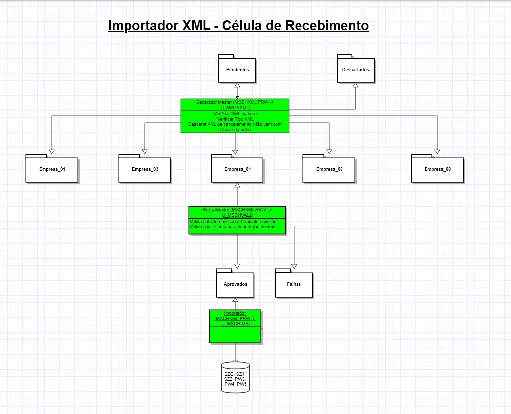

# MSCHXML.PRW

**Importação de XML**

### **Dados da Customização**

----

Analista: Jonathan Torioni

----

### **Especificação da Customização**

----

Está customização tem o objetivo de realizar a importação de XML's emitidos contra os cnpjs da filiais realicionadas ao Grupo Shark.

**Separador Master** - O separador master é a definição dada a função **U_MSCHXML()**, onde realizará as validações iniciais e irá destinar os XML para as respectivas pastas de cada empresa.

Caso o Separador Master identifique que o XML é um CTE, é irá enviar o XML para a pasta **\interf\tse\CTE**. Caso ele identifique que é uma NFE, realizará a validação do XML na base de dados.

A validação do XML na base de dados consistem em verificar se a nota foi emitida com destino a algum CNPJ das filiais cadastradas no sistema, dessa forma, ele irá direcionar o XML para a pasta **\interf\tse\descartados** caso o XML já tenha sido importado anteriormente na base. Caso o XML não conste na base, ele será direcionado para a pasta **\interf\tse\EMPRESA_XX** onde XX é o código da empresa em questão.

**Pré-separador** - O pré-separador foi desenvolvido para fazer algumas análises específicas nos XML da empresa em que ele está configurado.

As validações são referente a datas de emissão e conteúdo do XML. Dessa forma, é garantido que os XML que serão importados no sistema, estão 100% integros. Caso o XML esteja nos padrões para importação, este é direcionado para a pasta **\interf\tse\EMPRESA_XX\aprovados**, caso contrário, é destinado a pasta **\interf\tse\EMPRESA_XX\falhas**.

----

### **Especificações das Funções e Rotinas**

----

**U_MSCHXML()** - Separador Mestre de XML, tem como finalidade, verificar se o XML já encontra-se na base e/ou validar se o mesmo é uma NFE/CTE emitida contra alguma filial das empresas.

**U_MVLDCH()** - Função responsável por verificar se a nota já foi importada anteriormente no sistema. 

**U_MRETCDEMP()** - Retorna o código da empresa filial com base no cnpj informado. Essa função foi desenvolvida para não ser necessário realizar uma conexão RPC durante a execução do separador mestre.

**FGetObjXml(_clArq,_clDRaiz)** - Retorna o objeto XML com base nos parâmetros informados, _clArq = Nome do arquivo |        _clDRaiz     = Diretorio do local raiz

**MCONNEC(lConnec)** - Realiza a conexão com o banco de dados. Função desenvolvida para realizar a conexão com o banco de dados, evitando assim utilizar a função RPCSetEnv(). lConnec - .T. connecta o banco, .F. finaliza a conexão.

**U_MSCHVAL2(_cEmp)** - Pré-validador, 2º micro serviço, responsável pela validação dos XML que foram separados pelo Separador Mestre.

**DtImpProtheus(cEmpImp,cFilImp)** - Retorna se a data de emissao é válida para importar XML.

**MFALHA(_cEmp, _cFile, _cSFile)** - Destina o XML para a pasta de falhas da empresa específicada. Função utilizada somente pelo Pré-validador -> **U_MSCHVAL2**.

**U_MSCHIMP(_cEmp)** - Importador. Esta função tem como objetivo pegar os xml da pasta \EMPRESA_XX\aprovados\ e realizar a importação dos dados para as tabelas SZG, SZ1, SZ2, PW3 e PW4.

**CTExTable(uXml, cCodEmp, cCodFil, cMD5)** - Função responsável pela gravação das tabelas PW3, PW4 e PW5.

**FGravTab(clArqv,clRaiz,clDest,alChvVer,clCodFil, llEmitSK, lImpManual, cFileXml, _Brow )** - Importa o XML para as tabelas necessárias com base (SZG, SZ1 e SZ2) nas informações recebidas através da função U_MSCHIMP

**ForIsTrat(cCNPJ)** - Retorna se a empresa é 01 - Tratores

**IsProdImportado(cCodProd)** - Verifica se o produto é importado (considera SB1 da Tratores )

:::info
**Observações**

O Job do separador master deve conter a seguinte configuração:

    [U_MSCHXML]
    Main=U_MSCHXML
    nParms=0
    Environment=PRODUCAO27 ;OU PRODUCAOSK		

    [ONSTART] 
    Jobs=U_MSCHXML
    RefreshRate=30

O Job pré-validador deve conter a seguinte configuração:

    [U_MSCHVAL2_XX]
    Main=U_MSCHVAL2
    nParms=1
    Parm1=XX -> Empresa
    Environment=PRODUCAO27 ;OU PRODUCAOSK	

    [ONSTART] 
    Jobs=U_MSCHVAL2_XX
    RefreshRate=30	

O Job importador deve contar a seguinte configuração:

    [U_MSCHIMP_XX]
    Main=U_MSCHIMP
    nParms=1
    Parm1=XX -> Empresa
    Environment=PRODUCAO27 ;OU PRODUCAOSK

    [ONSTART] 
    Jobs=U_MSCHIMP_XX
    RefreshRate=30	

:::
----

### **Configurações dos JOBS por completo**

----

    [U_MSCHXML]
    Main=U_MSCHXML
    nParms=0
    Environment=PRODUCAO27

    [U_MSCHVAL2_01]
    Main=U_MSCHVAL2
    nParms=1
    Parm1=01
    Environment=PRODUCAO27

    [U_MSCHVAL2_03]
    Main=U_MSCHVAL2
    nParms=1
    Parm1=03
    Environment=PRODUCAO27

    [U_MSCHVAL2_04]
    Main=U_MSCHVAL2
    nParms=1
    Parm1=04
    Environment=PRODUCAO27				
                
    [U_MSCHVAL2_06]
    Main=U_MSCHVAL2
    nParms=1
    Parm1=06
    Environment=PRODUCAO27

    [U_MSCHVAL2_08]
    Main=U_MSCHVAL2
    nParms=1
    Parm1=08
    Environment=PRODUCAO27

    [U_MSCHVAL2_11]
    Main=U_MSCHVAL2
    nParms=1
    Parm1=11
    Environment=PRODUCAO27

    [U_MSCHVAL2_23]
    Main=U_MSCHVAL2
    nParms=1
    Parm1=23
    Environment=PRODUCAO27

    [U_MSCHVAL2_24]
    Main=U_MSCHVAL2
    nParms=1
    Parm1=24
    Environment=PRODUCAO27	

    [U_MSCHIMP_01]
    Main=U_MSCHIMP
    nParms=1
    Parm1=01
    Environment=PRODUCAO27

    [U_MSCHIMP_03]
    Main=U_MSCHIMP
    nParms=1
    Parm1=03
    Environment=PRODUCAO27	

    [U_MSCHIMP_04]
    Main=U_MSCHIMP
    nParms=1
    Parm1=04
    Environment=PRODUCAO27	
        
    [U_MSCHIMP_06]
    Main=U_MSCHIMP
    nParms=1
    Parm1=06
    Environment=PRODUCAO27

    [U_MSCHIMP_08]
    Main=U_MSCHIMP
    nParms=1
    Parm1=08
    Environment=PRODUCAO27	

    [U_MSCHIMP_11]
    Main=U_MSCHIMP
    nParms=1
    Parm1=11
    Environment=PRODUCAO27

    [U_MSCHIMP_23]
    Main=U_MSCHIMP
    nParms=1
    Parm1=23
    Environment=PRODUCAO27

    [U_MSCHIMP_24]
    Main=U_MSCHIMP
    nParms=1
    Parm1=24
    Environment=PRODUCAO27

    [U_Schleg01]
    Main=U_Schleg01
    Environment=PRODUCAO27

    [U_Schleg03]
    Main=U_Schleg03
    Environment=PRODUCAO27																

    [U_Schleg04]
    Main=U_Schleg04
    Environment=PRODUCAO27

    [U_Schleg06]
    Main=U_Schleg06
    Environment=PRODUCAO27

    [U_Schleg08]
    Main=U_Schleg08
    Environment=PRODUCAO27	

    [U_Schleg11]
    Main=U_Schleg11
    Environment=PRODUCAO27	

    [U_Schleg23]
    Main=U_Schleg23
    Environment=PRODUCAO27	

    [U_Schleg24]
    Main=U_Schleg24
    Environment=PRODUCAO27			

    [ONSTART] 
    Jobs=U_MSCHXML,U_MSCHVAL2_01, U_MSCHVAL2_03, U_MSCHVAL2_04, U_MSCHVAL2_06, U_MSCHVAL2_08, U_MSCHVAL2_11, U_MSCHVAL2_23, U_MSCHVAL2_24,U_MSCHIMP_01,U_MSCHIMP_03, U_MSCHIMP_04, U_MSCHIMP_06, U_MSCHIMP_08, U_MSCHIMP_11, U_MSCHIMP_23, U_MSCHIMP_24, U_Schleg01, U_Schleg03, U_Schleg04, U_Schleg06, U_Schleg08, U_Schleg11, U_Schleg23, U_Schleg24
    RefreshRate=30

----

### **Funcionamento**

----

Para o devido funcionamento dos jobs que realizarão a validação/importação do XML's, todos os arquivos devem estar na pasta pendentes dentro de: **\interf\tse\pendentes**

Todas as pastas de dependência dos jobs serão criadas automaticamente.

