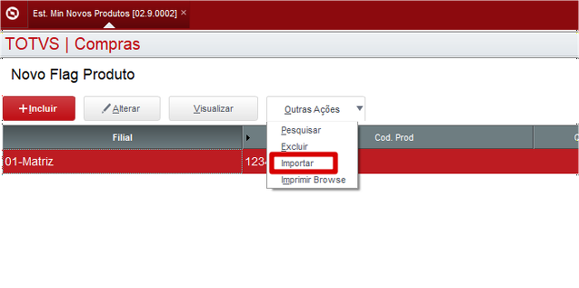

# New Flag de Produtos - Importador

**Importação de Itens através de um CSV**

### Dados da customização

Analista responsável: Rafael Gomes

----

### Especificação da customização

Nova função como objetivo fazer importação de produtos em massa através de um CSV.

----

### Especificação de funções e rotinas

* **U_SHIMPFLAG** - Função para importar itens através do CSV

----

### Especificação de parametros

Nenhum

:::info
O arquivoi CSV deve conter os campos na sequencia **"FILIAL;COD.PROD;QTD MIN EST;QTD DIAS REP"**.
:::

----

### Execução do Processo

* Acesso a rotina
**Atualizações>Compras>Central de Compras*>Est. Min Novos Produtos**

* Ao abrir o Browser, vá em **Outras Ações** e clica em **Importar**    

* Vai abrir a tela para selecionar o arquivo CSV    

* Após selecionar o arquivo os produtos vai aparecer na tela conforme mostra abaixo no exemplo: 

