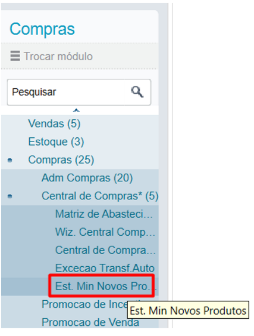
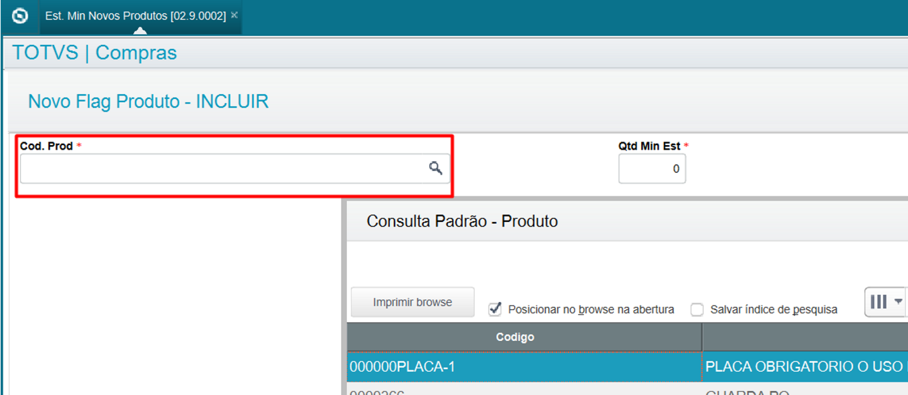
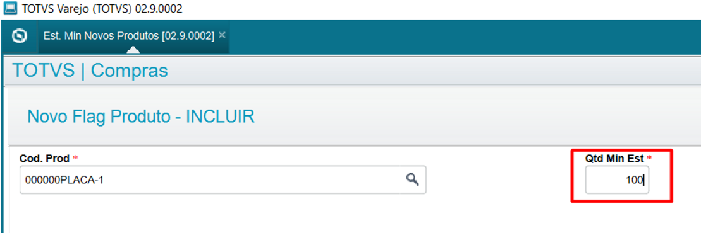
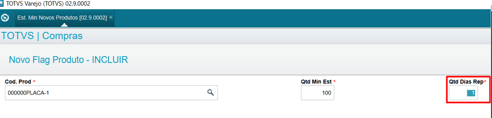
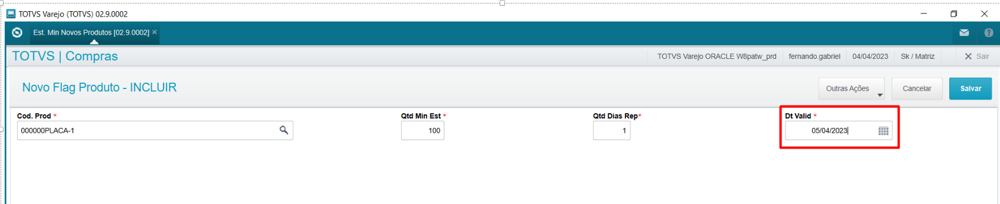

# New Flag de Produtos

**Estoque mínimo novos produtos**

## Dados da Customização

Analista: Fernando Gabriel 

Fonte: SHNEWFLAG.PRW

----

## Especificação da customização

Axcadastro simples apenas para realizar o cadastro do estoque mínimo de novos produtos.

----

## Cadastro:

Menu: Est min Novos produtos

1 - Código do produto para validação do estoque mínimo

2 - Quantidade mínima do estoque para transferência

3 - Quantidades de dias respeitados para transferência

4 - Data de validade respeitada para a transferência. OBS: a data de validade e sempre calculada de acordo com a data base mais a quantidade de dias respeitados.

## Tabela 
### Campos

X3_ARQUIVO|X3_CAMPO|X3_TIPO|X3_TAMANHO|X3_DECIMAL|X3_TITULO
---|---|---|---|---|---
PD6|PD6_FILIAL|C| 2|0|Filial      
PD6|PD6_COD   |C|27|0|Cod. Prod   
PD6|PD6_QTDEST|N| 5|0|Qtd Min Est 
PD6|PD6_DREPAT|N| 4|0|Qtd Dias Rep
PD6|PD6_DVALID|D| 8|0|Dt Valid    

### Indices

INDICE|ORDEM|CHAVE
---|---|---
PD6|01|PD6_FILIAL+PD6_COD                          
PD6|02|PD6_FILIAL+PD6_COD+PD6_DVALID  

### Gatilho

X7_CAMPO|X7_SEQUENC|X7_REGRA|X7_CDOMIN
---|---|---|---
PD6_DREPAT|001|Date()+PD6_DREPAT|PD6_DVALID

## Especificação de funções:

**U_SHPRDFLAG** - Função para validar registro do estoque. 
Retorno: `Array{Data de validade do produto, Quantidade de estoque, Data de validade do estoque}`
