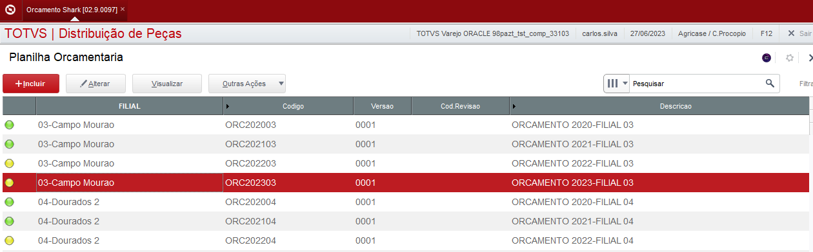
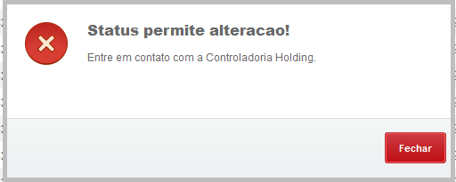

# PA100ALT.PRW

**Bloqueio de alteração nos Planos Orçamentarios**

97 > Distrubuição de Peças > Plano Orcamentario > Orcamento Shark

----

## Dados da Customização

Analista: Carlos Henrique

----
## Especificaçãoo da customização

Tem como objetivo bloquear a alteração da Planilha Orcamentaria, deixando o uso exclusivo por usuários da controladoria.

----

## Especificação de funções e rotinas

- **PA100ALT** - Função principal;

- **AJSTAK3** - Ajusta o cabeçalho do orçamento marcado

----

## Especificação de parametros

- **ES_PCOALT** - Ativa alcada para alterar orcamentos 

- **ES_PCOMTZ** - Usuários com permissão para alterar orçamento

## Processo

Rotina: **Planilha Orcamentaria**

1- Posicione em um registro e clique em alterar

2 - Só é permitido o acesso para os usuarios que estiverem no paremetro ES_PCOMTZ, caso contrario irá apresentar a seguinte mensagem:

