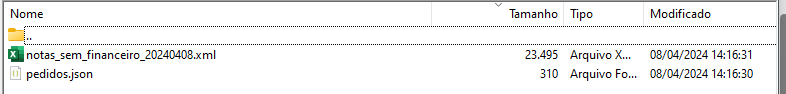

# RFAT004.PRW

**Auditoria notas faturadas sem financeiro**

### Dados da customização

Analista responsável: Jonathan Torioni

----

### Especificação da customização

Customização responsável por montar um relatório diário com notas faturadas que não geraram financeiro.

Fonte projetado para execução em schedule, execução diária e ao final do expediente.

----

### Especificação de parametros

**ES_AUDNF** = E-mails responsáveis por receber o relatório

----

### Funções

**RFAT004()** - Função principal por executar a consulta e orquestrar a chamadas das funções subsequentes.

**GerJson(aDados)** - Função responsável por gerar o Json com controle de notas.

**GtJson()** - Função responsável por pegar as notas contidas no json

**PutDados(aDQry)** - Função responsável por comprar os dados coletados pela consulta e os dados das notas já gravadas anteriormente, gerando assim um novo arquivo e relatório para notificação.

**GEREXC(aDados)** - Função responsável por gerar o arquivo xml compativel com excel - Relatório

**SENDREL(cFile)** - Função respnsável por enviar o relatório por e-mail

----

### Dependências

Para a execução correta do fonte, ele depende de outras customizações previamentes compiladas no RPO, sendo:

* **MENVMAIL.PRW** - Fonte respnsável por enviar e-mails de forma assíncrona.
* **/INTERF/TMP/AUDIT_NOTAS** - Pasta onde será armazenados os arquivos Pediodos.json e os arquivos de relatórios *.xml

----

### Resultado do processamento

Ao terminar o processamento a rotina irá atualizar o aquivo Pedidos.json e irá gerar o relatório em xml dentro da pasta informada na sessão **Dependências**.

**Arquivos gerados:**

**E-mail de notificação:**

