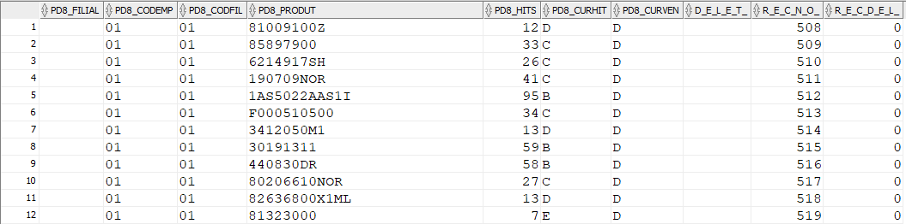

# SHGERABC.PRW

**SHGERABC.PRW - Fonte gerador de CURVA ABC Agricolas**

### **Dados da Customização**

**Analista:** Jonathan Everton Torioni Oliveira

----

### **Especificação da Customização**

Customização responsável por gerar as curvas ABC no grupo agricolas.
Este fonte gera Curvas ABC classificando por % valor de venda e também por Hits (Frequencia de venda dos produtos).

:::info
Este fonte foi desenvolvido para rodar exclusivamente via Schedule, passando o código da empresa e primeira filial como parâmetro.
:::

**Classificação por % de vendas**

Classificação/Curva|% Valor Venda
---|---
A|70
B|20
C|10
D|0

Obs.: processamento e classificação por item, com base no faturamento de cada filial.

**Classificação - Frequência de Venda**

Classificação / Curva | Hits (12 meses anteriores) | Giro | Mostra na Sugestão de Compra
---|---|---|---
A|Acima 99|Alto|Sim
B|50-99|Alto|Sim
C|20-49|Alto|Sim
D|12-19|Alto|Sim
E|6-11|Alto|Sim
F|3-5|Alto|Sim
G|1-2|Alto|Não
H|0|Alto|Não
I|Itens Novos|Alto|Sim

Obs.: Processamento e classificação por item, com base na frequência de venda em cada filial

**Classificação letras A à H (itens ativos):**
"Hit" representa a quantidade de vendas do produto, e não a quantidade de peças vendidas. 
Transferências e Vendas "Intercompany" não devem ser consideradas.

**Classificação letra I (itens novos):**
Estabelecida no momento da primeira entrada no estoque da filial, com duração de 120 dias corridos;
Após o período acima, o produto será classificado com base no padrão de itens ativos (A à H, baseada nos hits);
Transferências e Vendas "Intercompany" devem ser consideradas.

----

### **Especificação de Tabelas e Índices**

**Tabela PD8G01**

X3_ARQUIVO|X3_CAMPO|X3_TIPO|X3_TAMANHO|X3_DECIMAL
---|---|---|---|---
PD8|PD8_FILIAL|C|2|0
PD8|PD8_CODEMP|C|2|0
PD8|PD8_CODFIL|C|2|0
PD8|PD8_PRODUT|C|27|0
PD8|PD8_HITS  |N|10|0
PD8|PD8_CURHIT|C|1|0
PD8|PD8_CURVEN|C|1|0

**Indice:**
PD8_FILIAL+PD8_CODEMP+PD8_CODFIL+PD8_PRODUT

----

### **Especificação de Parâmetros**

Não possui

----

### **Consulta PD8 - Curvas**

