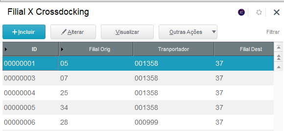
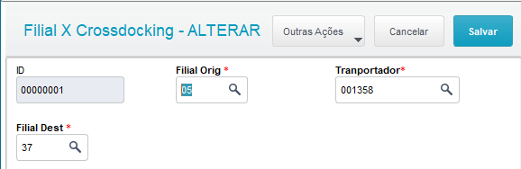

# SK Crossdocking

**Cadastro de transportadora (De Para)**

### Dados da Customização

----

Analista: Jonathan Torioni

Fonte: **skcadcrossdoking.prw**

----

### Especificação da Customização

Axcadastro simples apenas para realziar o De para de transportadoras para os pedidos de transferência automático

----

### Cadastro

O cadastro é feito de forma bastante simples, existe apenas três campos para preenchimento, sendo:
* **Filial Orig**
* **Transportador**
* **Filial Dest**

Ao acessar a rotina, irá aparecer a seguinte tela:

Clique no botão **+Incluir** e preencha os campos conforme a imagem abaixo:

No campo Filial Orig, deve ser informado a filial da qual será enviada a mercadoria, no campo Transportador, preencha com o código da transportadora que realizará a coleta e entrega da mercadoria e no campo Filial Dest, preencha qual a filial receberá a mercadoria.

Após o preenchimento de todas as informações, clique em **Salvar**

As rotinas de funcionamento automátio passaram a obedecer a regra cadastrada nesta rotina.

:::info
Este processo foi desenvolvido com o objetivo de realizar o abastecimento e desabastecimento automático das filiais ligados ao processo de Central de compras.
:::

:::caution
Este processo deve ser realizado pelo departamento logistico!
:::
