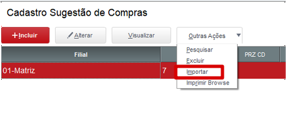
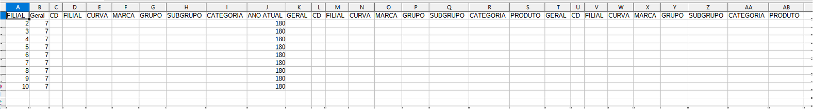

# SUGCOMSK.PRW

**Importação dos parâmetros através de um CSV**

### Dados da customização

Analista responsável: Rafael Gomes

----

### Especificação da customização

Nova função como objetivo fazer importação dos parâmetros em massa através de um CSV.

----

### Especificação de funções e rotinas

* **U_SHIMPWIZ** - Função para importar itens através do CSV

----

### Especificação de parametros

Nenhum

:::info
O arquivo CSV deve conter os campos na sequencia **"FILIAL;Geral;CD;FILIAL;CURVA;MARCA;GRUPO;SUBGRUPO;CATEGORIA;ANO ATUAL;GERAL;CD;FILIAL;CURVA;MARCA;GRUPO;SUBGRUPO;CATEGORIA;PRODUTO;GERAL;CD;FILIAL;CURVA;MARCA;GRUPO;SUBGRUPO;CATEGORIA;PRODUTO"**.
:::

----

### Execução do Processo

* Acesso a rotina
Atualizações => Compras => Central de Compras* => Wiz. Central Compras

* Ao abrir o Browser, vá em **Outras Ações** e clica em **Importar**

* Vai abrir a tela para selecionar o arquivo CSV

* Planilha a ser importada

* Após selecionar o arquivo os parâmetros vai aparecer na tela conforme mostra abaixo no exemplo:

