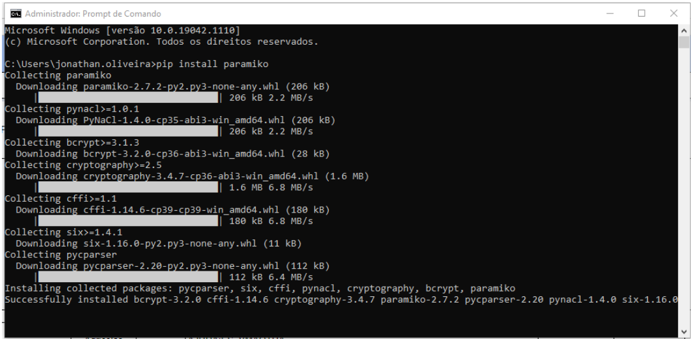
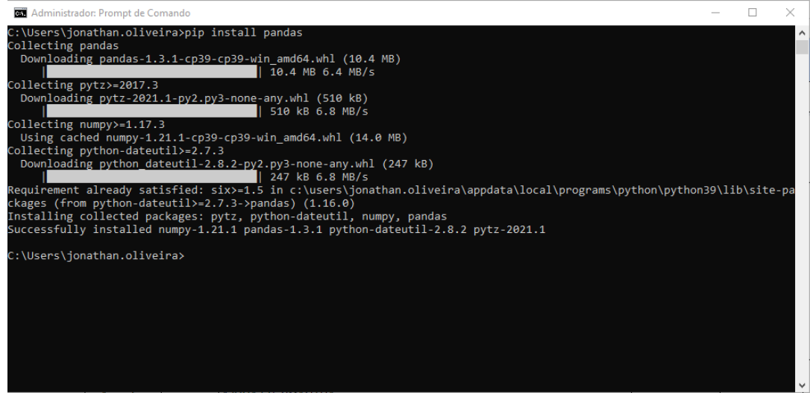
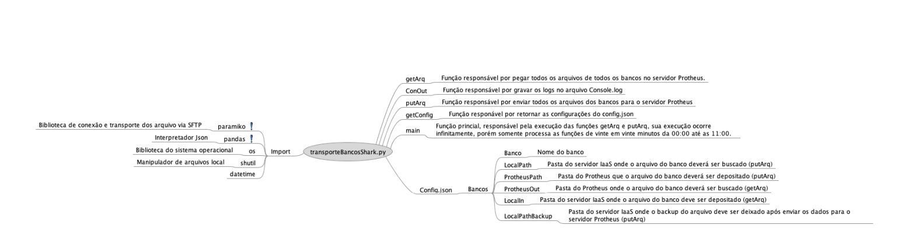

# transporteBancosShark.py

**Transporte de arquivos bancários entre Protheus e IaaS**

### **Dados da Customização**

----

Analista: Jonathan Torioni

----

### **Objetivo**

----

Script desenvolvido com o objetivo de realizar os transportes dos arquivos bancários entre os servidores Protheus e o servidor IaaS.

Este script foi desenvolvido mediante a uma limitação da linguagem ADVPL, esta limitação impede a conexão e manipulação de
arquivos via SFTP. Com a migração para TOTVS Cloud, os servidores Protheus só possuem comunicação externa via SFTP.

----

### **Descrição**

----


Desenvolvido em Python, o script transporteBancosShark, tem como finalidade, transportar os arquivos gerados pelos programas
bancários para os servidores Protheus, bem como realizar o transporte dos processamentos realizados pelo Protheus até as pastas dos
programas bancários.

Para que o script seja completamente independente de edição, foi desenvolvido as seguintes funcionalidades:

* **getArq** – Função responsável por pegar todos os arquivos de todos os bancos no servidor Protheus e colocar no servidor IaaS;
* **putArq** – Função responsável por enviar todos os arquivos dos bancos para o servidor Protheus;
* **ConOut** – Função responsável por gravar os logs de processamento no arquivo Console.log;
* getConfig – Função responsável por retornar as configurações do config.json;
* **main** – Função princial, responsável pela execução das funções getArq e putArq, sua execução ocorre infinitamente, porém
somente processa as funções de vinte em vinte minutos da 00:00 até as 11:00.

Todas as funcionalidades desenvolvidas seguem as configurações disponíveis no arquivo config.json, este arquivo segue a seguinte
estrutura:

* **Bancos**
  - **Banco** – Nome do banco
  - **LocalPath** – Pasta do servidor IaaS onde o arquivo do banco deverá ser buscado (putArq)
  - **ProtheusPath** – Pasta do Protheus que o arquivo do banco deverá ser depositado (putArq)
  - **ProtheusOut** – Pasta do Protheus onde o arquivo do banco deverá ser buscado (getArq)
  - **LocalIn** – Pasta do servidor IaaS onde o arquivo do banco deve ser depositado (getArq)
  - **LocalPathBackup** – Pasta do servidor IaaS onde o backup do arquivo deve ser deixado após enviar os dados para o
servidor Protheus (putArq)

Para o Banco do Brasil, foi realizado uma tratativa específica devido a estrutura de pastas diferenciada. Nas chaves ProtheusOut e LocalIn,
deve-se indicar somente a base das pastas. Ex: cnab2/bb/%, o caracter de porcentagem, faz uma referência na string que permite o código
completar o restante da path, dessa forma a seguinte path será buscada: **'\cnab2\bb\+'Cod_empresa'+\bbsia\'** e
**'\cnab2\bb\+'Cod_empresa'+\bbsiapag\'**.

:::info
**Esta tratativa é única e exclusiva para o Banco do Brasil.**
:::

----

### **Instalação**

----

Após realizar a instalação do Python, instale as seguintes bibliotecas:

* **PARAMIKO**
* **PANDAS**

Para instalar as bibliotecas, execute o terminal como administrador e digite:

```dos
- pip install paramiko
```



```dos
- pip install pandas
```


----

### **Mapa mental**

----


