# Wizzard Central de compras

**Wizzard Central de compras**

### Dados da Customização

----

Analista: Jonathan Torioni

Fonte: **SHSUGCOM.PRW**

----

### Especificação da Customização

----

O objetivo wizard, é armazenar todas as preferências cadastradas para gerar uma sugestão de compra com base no histórico de vendas dos produtos cadastrados no estoque. Além de permitir realizar um cadastro genérico (onde todos os produtos irão se enquadrar), existe a possibilidade de realizar cadastros específicos para determinados, produtos, linhas, marcas, grupos, etc.

----

### Especificações dos steps

----

1. Prazo para Analise
    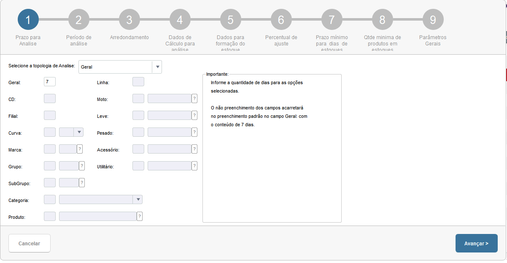
    Nesta tela, será informado a quantidade de dias que o processo automático de avaliação do estoque será executado, recomendamos que deixe o campo geral com 7 dias, dentro desses dias o programa irá gerar dados estatísticos para as sugestões de compras.

2.	Período de Análise
    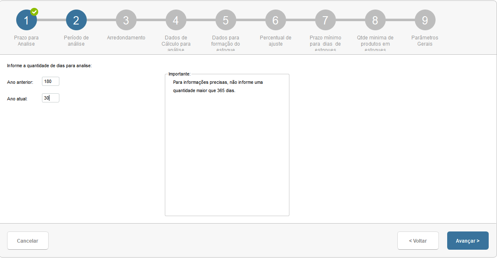
    Nesta tela, é definido os períodos de vendas que serão analisadas pela rotina automática, com base na quantidade de dias informadas, o programa irá avaliar todas as vendas realizadas do ano anterior e do ano atual. Por convenção em reuniões passadas, obtivemos excelentes resultados com os parâmetros Ano anterior com 180 dias e Ano atual com 30.
    Recomendamos que os mesmos permaneçam com esta definição.

3. Arredondamento
    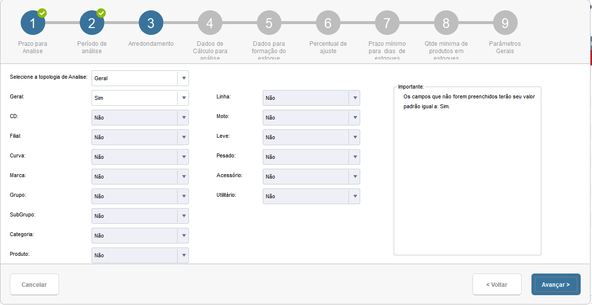
    Nesta tela, será definido se os produtos terão arredondamento, na pratica isso reflete diretamente nas quantidades sugeridas, durante os cálculos estatísticos, muitas vezes obtemos valores quebrados, Ex: 4,125 peças, para que possamos realizar uma sugestão efetiva, recomendamos que o parâmetro geral esteja com Sim, os arredondamentos seguem o principio matemático, acima de 0,5 arredonda para cima e abaixo de 0,5 arredonda para baixo. Ex: 1,51 passa a ser 2,0 e 1,49 passa a ser 1.
    No que se refere a múltiplos de compras, o programa de sugestão de compras já consolida os valores pelos seus respectivos múltiplos, isso significa que por mais que um determinado item tenha sugestão de 11 unidades, ele consolida pelo múltiplo de compra.

4.	Dados de Cálculo para análise
    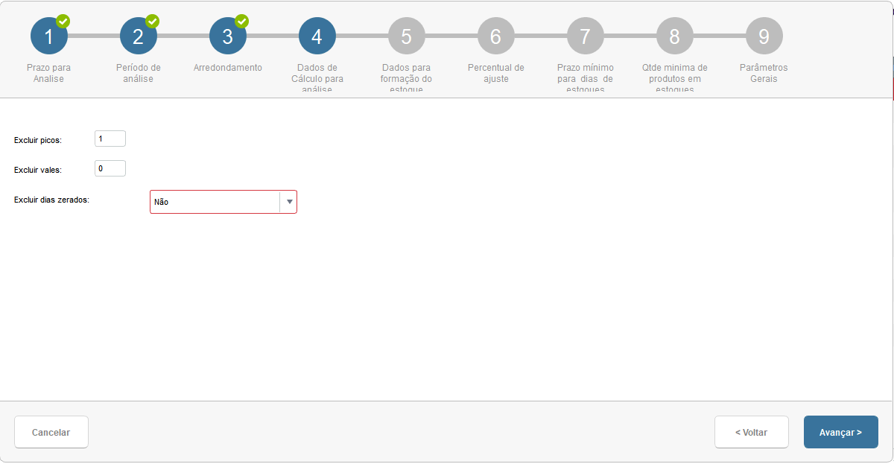
    Nesta tela, será definido a quantidade de exclusões de picos e vales das amostras estatísticas coletadas pelo programa de execução automática. Isso está relacionado especificamente as formulas matemáticas utilizadas para os cálculos. Durante todos os testes realizados, ficou definido a quantidade 1 para exclusão de picos e 0 para a exclusão de vales.
    O parâmetro Excluir dias zerados, deve permanecer como não, isso garantirá que toda a amostra será preservada, ou seja, também considera os dias que não tiveram vendas nos períodos informados na tela 2 - Período de análise.

5.	Dados para formação do estoque
    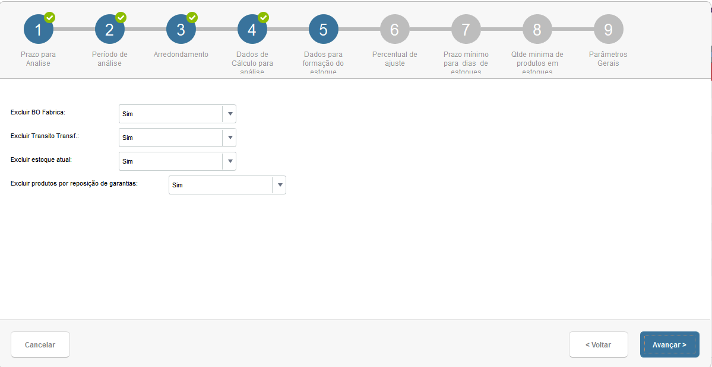
    Nesta tela, será definido as preferencias para formação do estoque, isso reflete diretamente na sugestão de compras, onde, no momento da geração da sugestão, o programa irá identificar os BO Fabrica, Transito Transf., Estoque atual e Produtos por reposição de garantias, e irá considerar ou não esses valores para definir a quantidade sugerida. 
    Ex: Se o produto 32208 estiver com 30 unidades em BO Fabrica, e o programa calcular uma sugestão de 50 unidades, ele irá consultar o parâmetro Excluir BO Fabrica e estiver como Sim, ele irá desconsiderar os BO e irá sugerir as 50 unidades, caso o parâmetro esteja com Não, ele passa a considerar os BO e irá sugerir a compra de apenas 20 unidades. O mesmo principio segue para os outros parâmetros.

6.	Percentual de ajuste
    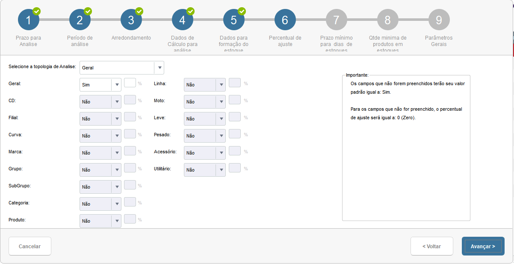
    Nesta tela, será definido o percentual de ajuste para cada categoria informada, ou geral. Quando não preenchido o programa irá considerar os percentuais de ajuste como 0.
    Os percentuais de ajuste servem basicamente para caso você identifique que os cálculos de sugestão de compras não estejam indicando quantidades o suficiente para abastecer a filial pelo período determinado (na tela seguinte), você possa acrescentar o percentual para o valor ser ajustado para mais.
    Ex: Supondo que eu defini prazo mínimo de dias de estoque para 60 dias, e com base nisso, a sugestão de compra identificou que para o produto 32208, seria necessário comprar 100 unidades, porém o comprador com a sua experiencia identificou que 100 unidades não conseguem suprir a filial por 60 dias e que a quantidade ideal seria 110. Para este caso, recomenda-se criar um cadastro no wizard específico para este produto e no percentual de ajuste, informar o conteúdo 10 na categoria Produto. Dessa forma o programa irá sugerir 10% a mais na sua compra, sendo 110 unidades.

7.	Prazo mínimo para dias de estoque
    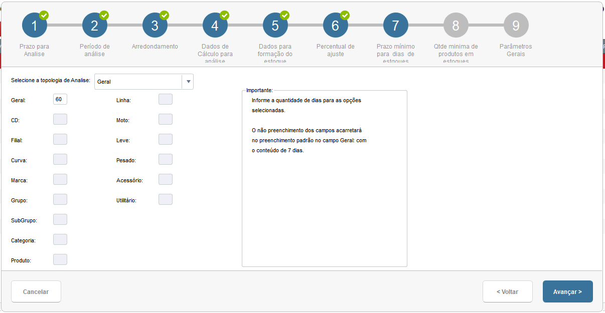
    Esta é uma das telas com maior importância em todo o cadastro do Wizard. Nesta tela, será definido a quantidade de dias para os produtos em estoque, Ex: Se informado 60 dias no campo Geral, o Central de compras irá gerar uma sugestão de compras (para todos os produtos que tenham cálculos estatísticos), sugerindo a compra de x produtos, esse x produtos serão a quantidade necessária para abastecer a filial por 60 dias, sem a necessidade recompra dentro deste período.
    Ex: Produto 32208 para 60 dias, irá me sugerir comprar 100 unidades, para 30 dias, irá me sugerir comprar 50 unidades.

8.	Quantidade mínima de produtos em estoque
    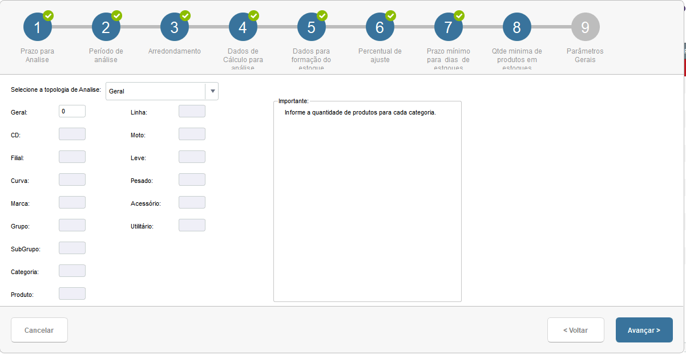
    Nesta tela, deverá ser informado a quantidade mínima de produtos em estoque, recomendamos fortemente que utilizem o cadastro de produtos para definir a quantidade mínima de produtos em estoque e mantenha essa tela mantenha com os preenchimentos iguais a 0
    Ex: Caso você tenham uma mercadoria que custe 500 mil reais, e você preenche essa tela com 7, o programa de sugestão de compra irá indicar para você comprar 7 unidades deste produto para ter de estoque mínimo, isso pode acarretar em uma sugestão com o valor de 3,5 milhões de reais.
    Obs: Use essa tela com muita cautela.

9.	Parâmetros Gerais
    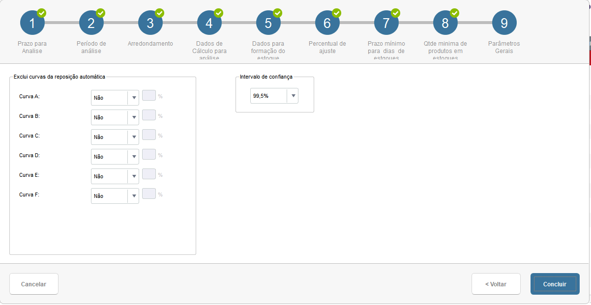
    Nesta tela, será configurado a exclusão em porcentagem das curvas e o intervalo de confiança.
A exclusão da curva segue o mesmo principio explicado na tela 6, porém excluindo a quantidade sugerida em porcentagem dos produtos com suas respectivas curvas.
O intervalo de confiança se refere a uma porcentagem definida nas formulas matemáticas para os cálculos estatísticos.
Por padrão definimos 99,5%, isso indica que em 99,5 % das sugestões, as quantidades sugeridas conseguirão atender as necessidades da filial conforme os parâmetros preenchidos.

:::info

Observação: As orientações acima foram exemplificando um cadastro genérico, logo todos os produtos que tiverem cálculos estatísticos seguirão essas parametrizações.
Todas as filiais devem possuir esse cadastro generalizado, pois é com base nele que os dados estatísticos serão gerados. Abaixo vou exemplificar um cadastro para um produto específico.
:::

----

### Cadastro específico

----

As orientações abaixo são para um produto específico, mas o mesmo conceito se aplica para qualquer linha, categoria, curva, etc.

Repare que como o produto é específico, todos os dados são pensando apenas no produto que está sendo cadastrando, nas telas 1, 3, 5, 6, 7 e 8  sempre preenchida na categoria do produto.
Quando for cadastrar regrar para uma determinada categoria, grupo, subgrupo... deve-se seguir o preenchimento nas telas 1, 3, 5, 6, 7 e 8.

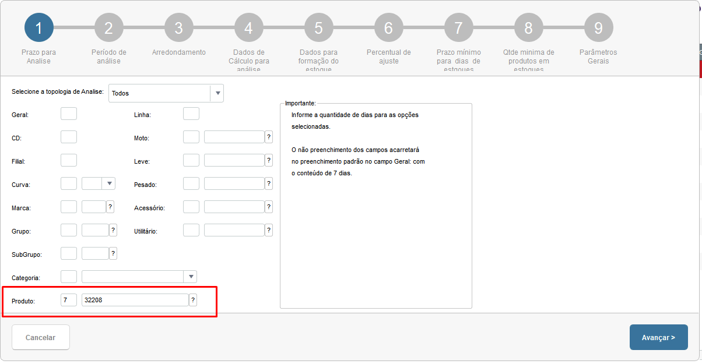
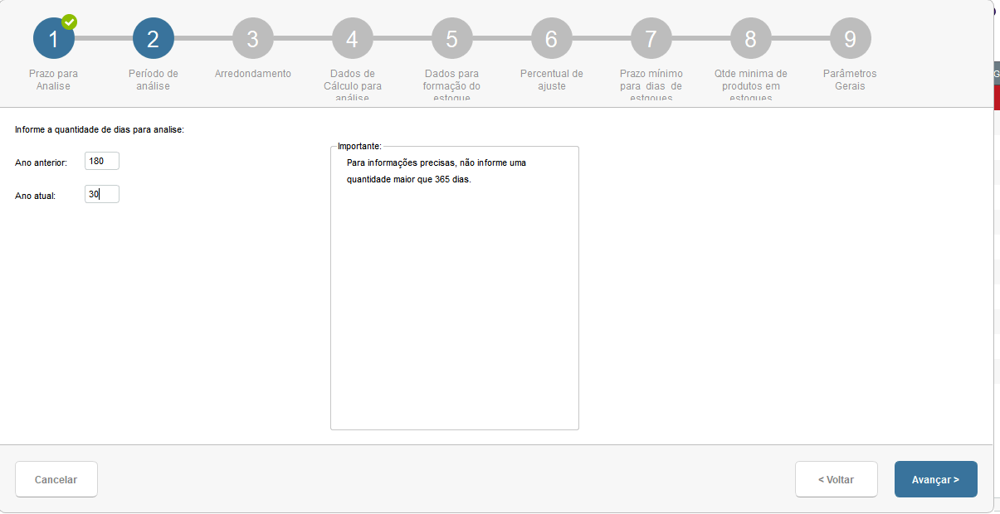
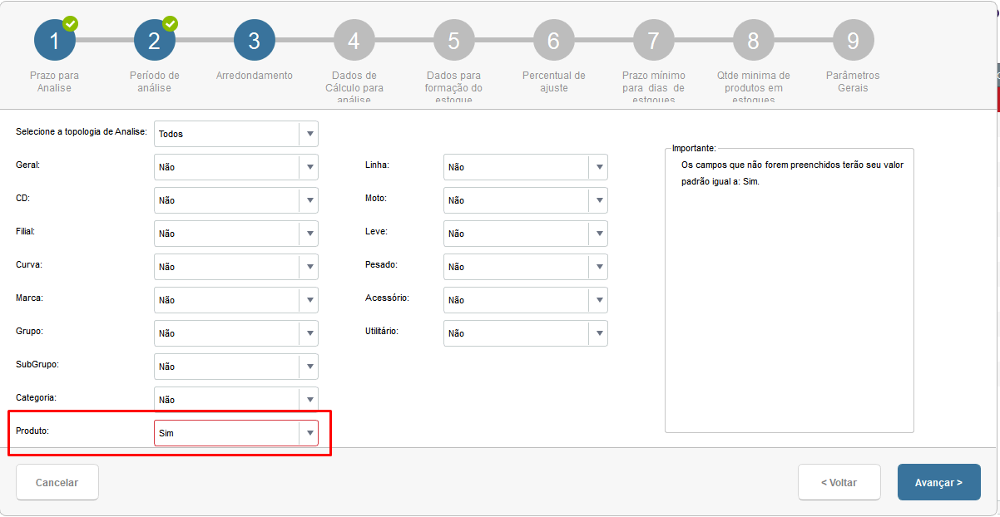
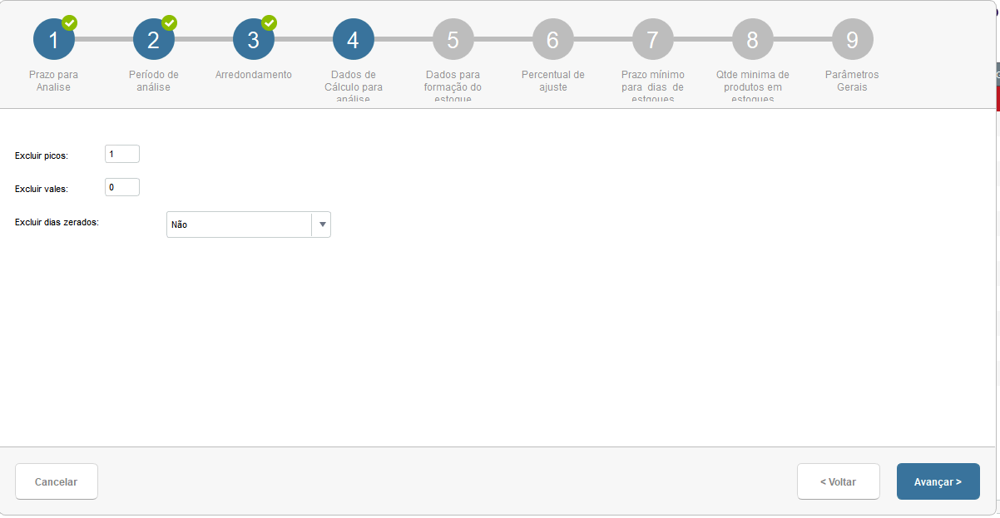
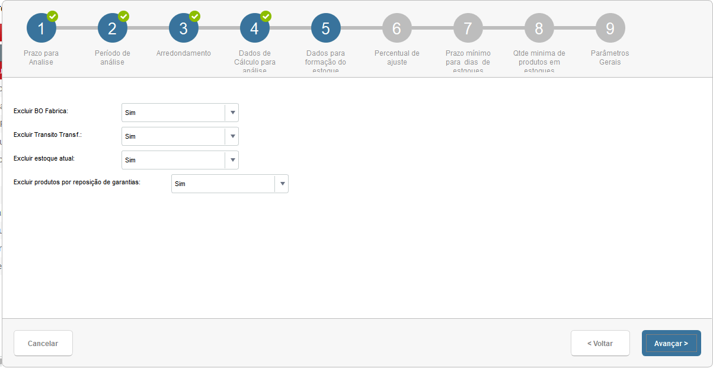
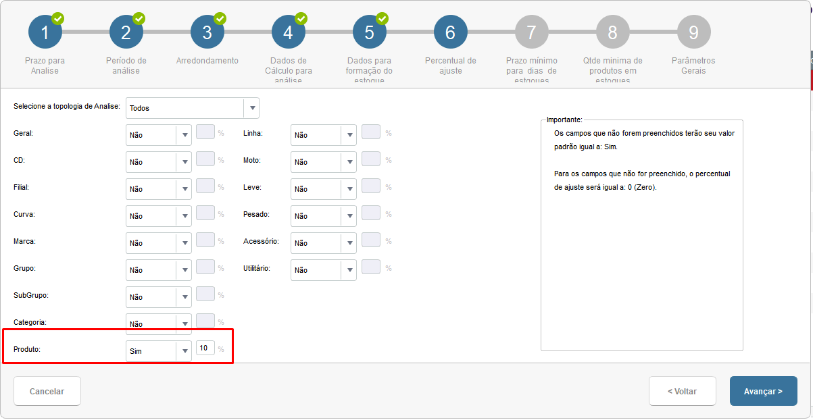
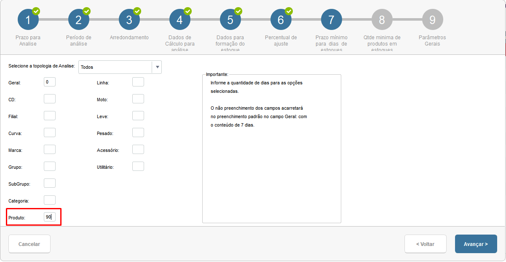
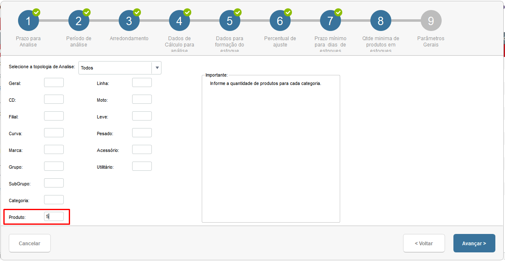
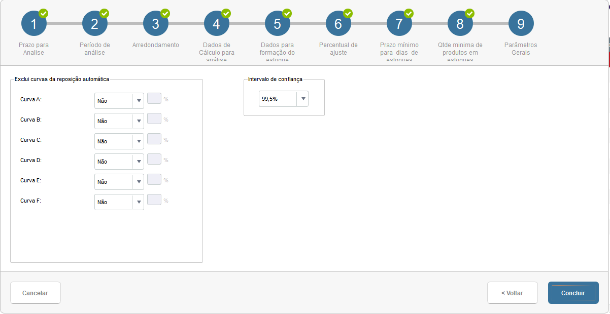

:::info
Observação: Mesmo tendo cadastros genéricos, quando um cadastro é específico, a sugestão e os cálculos sempre serão com base neste cadastro específico e os demais produtos seguem o genérico.
:::
